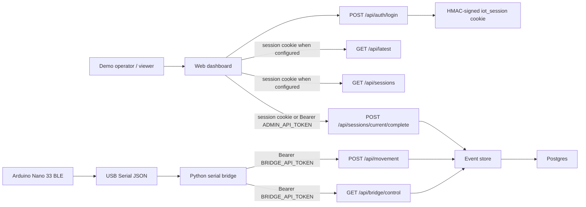

# STRIDE Security Threat Model

This document records the security model for the IoT TinyML demo. The goal is practical coursework evidence and lightweight protection for the deployed demo, not enterprise-grade identity management.

## System Overview



## Assets And Trust Boundaries

- Board sensor events: voice, colour, movement, and debug confidence values.
- Session history: recorded events, movement samples, timestamps, and completion status.
- Control actions: session completion and bridge shutdown.
- Secrets: `BRIDGE_API_TOKEN`, `ADMIN_API_TOKEN`, `DASHBOARD_PASSWORD`, `SESSION_SECRET`, and Postgres credentials.
- Trust boundary 1: USB serial from the board to the local bridge.
- Trust boundary 2: HTTP from the bridge/browser to the web API.
- Trust boundary 3: web API to Postgres inside Docker.

## STRIDE Analysis

| Category | Threat | Impact | Mitigation |
| --- | --- | --- | --- |
| Spoofing | Someone posts fake board events to `/api/movement`. | Fake sessions or fabricated movement data. | `BRIDGE_API_TOKEN` is required for event ingest when configured. |
| Spoofing | Someone calls bridge control as if they were the bridge. | Stop signals could be consumed or hidden. | `/api/bridge/control` requires `BRIDGE_API_TOKEN`. |
| Tampering | A user changes or ends a session without operator credentials. | Incomplete or false session history. | Stop API accepts only a valid operator session cookie or `ADMIN_API_TOKEN`. |
| Repudiation | A session is stopped or deleted with no trace. | Harder to explain demo outcomes. | Completed sessions store a `session_complete` event; incomplete auth runs are intentionally deleted by policy. |
| Information Disclosure | Postgres is reachable from the network. | Session data and credentials could be exposed. | Docker binds Postgres to `127.0.0.1` only. |
| Information Disclosure | Tokens or passwords leak through logs. | Attackers could post events, stop demos, or view dashboard data. | Bridge never prints token values; dashboard login uses an httpOnly signed cookie and does not store the admin token in browser `localStorage`. |
| Denial of Service | Unauthenticated clients spam event ingestion. | Database growth and noisy dashboard. | Token protection blocks unauthenticated ingest on deployed instances. |
| Denial of Service | Bridge is stopped by a random web request. | Demo recording ends unexpectedly. | Stop requires `ADMIN_API_TOKEN`; bridge control requires `BRIDGE_API_TOKEN`. |
| Elevation of Privilege | Anonymous viewer gains operator/admin control. | Viewer can inspect sessions, stop the bridge, or delete incomplete recordings. | Dashboard pages/read APIs require the signed session cookie when `DASHBOARD_PASSWORD` is configured; admin mutation also accepts `ADMIN_API_TOKEN` for automation. |

## Implemented Security Controls

- `POST /api/movement` requires `Authorization: Bearer <BRIDGE_API_TOKEN>` when `BRIDGE_API_TOKEN` is set.
- `GET /api/bridge/control` requires `Authorization: Bearer <BRIDGE_API_TOKEN>` when `BRIDGE_API_TOKEN` is set.
- `POST /api/sessions/current/complete` requires either a valid operator `iot_session` cookie or `Authorization: Bearer <ADMIN_API_TOKEN>` when auth is configured.
- `POST /api/auth/login` verifies `DASHBOARD_PASSWORD` and issues an HMAC-SHA256 signed, httpOnly session cookie using `SESSION_SECRET`.
- Dashboard pages and read APIs require the session cookie when `DASHBOARD_PASSWORD` and `SESSION_SECRET` are configured.
- Local development remains frictionless: if token env vars are absent, the routes allow requests.
- Docker deployment requires both API tokens and the dashboard/session secrets through Compose variable checks.
- Postgres is bound to localhost on the host, not exposed to the public network.
- The bridge sends the bearer token through `--api-token` or `BRIDGE_API_TOKEN`.
- The dashboard uses the session cookie path and does not store `ADMIN_API_TOKEN` in browser storage.

## Residual Risks

- HTTP is still plain text if the server is exposed directly on port `3000`; use HTTPS or a reverse proxy for a public network.
- Tokens and `DASHBOARD_PASSWORD` are shared secrets, not per-user accounts. Anyone with the relevant secret has that role.
- Without HTTPS, bearer tokens and login traffic can be observed on the network.
- Physical USB access to the board/bridge machine remains trusted.
- Debug events may include confidence values and raw sensor readings; disable debug flags for a cleaner public demo if needed.

## Operational Checklist

1. Generate secrets:

   ```bash
   openssl rand -hex 32
   ```

2. Set `BRIDGE_API_TOKEN`, `ADMIN_API_TOKEN`, `DASHBOARD_PASSWORD`, and `SESSION_SECRET` in `.env` before Docker deployment.
3. Start the bridge with:

   ```bash
   python bridge/serial_to_http.py \
     --port /dev/cu.usbmodemXXXX \
     --endpoint http://SERVER_IP:3000/api/movement \
     --api-token "$BRIDGE_API_TOKEN" \
     --verbose
   ```

4. Give only the demo operator the dashboard password. Keep `ADMIN_API_TOKEN` for external scripts and tests.
5. Do not expose Postgres beyond localhost.
