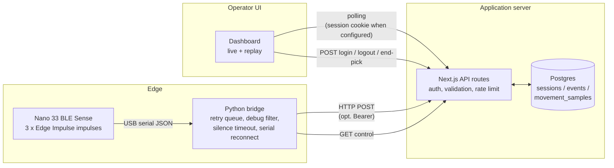

# System Architecture

This document describes the architecture of the Warehouse Sensor Node, maps it to a recognised IoT reference model, and records the rationale for the topology.

## High-level topology

```
                 .--------------------------.
                 |  Operator (warehouse)    |
                 |  - speaks "start"        |
                 |  - shows package tag     |
                 |  - moves the package     |
                 '-----------+--------------'
                             |
                  (sound, light, motion)
                             |
            .----------------v-----------------.
            |  Sensor node                     |
            |  Arduino Nano 33 BLE Sense       |
            |  (nRF52840 Cortex-M4 @ 64 MHz)   |
            |                                  |
            |  - PDM mic    -> voice model     |
            |  - APDS-9960  -> colour model    |
            |  - LSM9DS1    -> motion model    |
            |                                  |
            |  Three Edge Impulse impulses     |
            |  invoked through one combined    |
            |  Arduino library                 |
            '----------------+-----------------'
                             |  USB CDC serial, 115200 baud,
                             |  newline-delimited JSON
            .----------------v-----------------.
            |  Edge gateway                    |
            |  Python bridge                   |
            |  bridge/serial_to_http.py        |
            |                                  |
            |  - parses JSON lines             |
            |  - drops/downsamples debug       |
            |    events                        |
            |  - bounded retry queue with      |
            |    exponential backoff           |
            |  - polls dashboard for stop      |
            |  - silence-timeout exits non-0   |
            |  - retries serial reconnects     |
            '----------------+-----------------'
                             |  HTTP/JSON over LAN
                             |  POST /api/movement
                             |  (Authorization: Bearer)
            .----------------v-----------------.
            |  Application server              |
            |  Next.js (App Router) + Postgres |
            |  docker compose                  |
            |                                  |
            |  - /api/movement   ingest        |
            |  - /api/latest     live read     |
            |  - /api/sessions   history       |
            |  - /api/auth/login operator auth |
            |  - /api/bridge/control           |
            |  - /api/sessions/current/complete|
            |                                  |
            |  Postgres tables:                |
            |    sessions, events,             |
            |    movement_samples,             |
            |    recording_state               |
            '----------------+-----------------'
                             |  HTTP polling, 500 ms
                             |  (dashboard) / 2 s (sessions)
            .----------------v-----------------.
            |  Operator dashboard              |
            |  React client (page.js)          |
            |  - live scanner status           |
            |  - handling-motion telemetry     |
            |  - pick session timeline         |
            |  - end-pick / replay controls    |
            '----------------------------------'
```

The maintained visual diagram is `docs/diagrams/system-architecture.png`; it is the source used by the report.

## Mapping to the IoT World Forum reference model (7 layers)

The IoT World Forum reference model (Cisco, 2014) is the closest fit for this system because it gives explicit layers for *edge computing* and for the *operator/process* level — both of which are central here.

| # | Layer | What it means | Where it lives in this project |
|---|---|---|---|
| 1 | **Physical Devices and Controllers** | The "thing" itself — sensors and actuators that perceive the physical world. | Arduino Nano 33 BLE Sense, with the on-board PDM microphone, APDS-9960 RGB-and-gesture sensor, and LSM9DS1 9-axis IMU. |
| 2 | **Connectivity** | How devices talk to the next tier; transport, addressing, framing. | USB CDC serial at 115 200 baud, newline-delimited JSON. *Deliberately not Wi-Fi* — see `docs/design-decisions.md`. |
| 3 | **Edge (Fog) Computing** | Computation that happens close to the sensor to reduce upstream traffic. This is the layer modern IoT curricula emphasise most. | All three TinyML inferences run **on the MCU**, not in the cloud: voice keyword spotting, colour classification, and motion classification, served from one combined Edge Impulse library (`arduino/libraries/combined_inferencing/`). Only classification *results* leave the device, not raw audio or accelerometer samples. |
| 4 | **Data Accumulation** | Converting events-in-motion to data-at-rest; buffering and storage. | Python bridge holds an in-memory retry queue (bounded, ordered) for transient web-app outages and retries serial reconnects when the USB device is temporarily reconfigured. Postgres tables `events`, `sessions`, `movement_samples`, and `recording_state` provide durable storage. |
| 5 | **Data Abstraction** | Reconciling heterogeneous data into a queryable form. | `web/lib/eventStore.js` is the single abstraction over both the Postgres path and the development-only in-memory fallback. The dashboard never talks to either store directly; it sees a normalised JSON shape via the API routes. |
| 6 | **Application** | Domain-specific logic and user interfaces. | The Next.js dashboard (`web/app/page.js`): operator login, live scanner status, package-handling motion view, pick-session list and replay, end-of-pick control. |
| 7 | **Collaboration and Processes** | The human/business workflow the system supports. | The warehouse pick workflow itself: an operator voice-arms the scanner, presents a verified package tag, and the system records the handling motion and direction until the pick session is ended from the dashboard. |

## Why this topology

Three architectural decisions are the most consequential:

1. **Three on-device models, not one cloud model.** Audio, colour, and IMU all stream at sensor-native rates (16 kHz, ~44 Hz, ~44 Hz). Sending raw signals to a server would saturate the link and put a person's voice on a network unnecessarily. Running quantised models locally compresses each window to a single classification + confidence — a few hundred bytes of JSON. This is the canonical "Edge Computing" win at layer 3.

2. **A trusted serial bridge, not direct Wi-Fi from the MCU.** This is justified in detail in `docs/design-decisions.md`. The short version: the Nano 33 BLE Sense has no IP stack on board, the demo runs in a controlled physical environment, and a USB-tethered gateway lets a single host enforce auth, retry, and rate-limit policy on behalf of the device.

3. **Postgres as the source of truth, not a message queue.** A pick session has a clear lifecycle (start → voice-arm → tag-verify → handling → end) and the dashboard needs random-access replay, not a stream. A relational store fits that shape; a broker would be over-engineering. See `docs/design-decisions.md` for the HTTP-vs-MQTT comparison.

## Implementation map

| Layer | File / component |
|---|---|
| Sensors + on-device ML | `arduino/voice_colour_motion_demo/voice_colour_motion_demo.ino`, `arduino/libraries/combined_inferencing/` |
| Serial transport | USB CDC — `Serial.print(...)` on the firmware side, `serial.Serial(port, 115200)` on the bridge |
| Edge gateway | `bridge/serial_to_http.py` |
| Ingest API | `web/app/api/movement/route.js` (validation, optional bearer auth, optional rate limit, physical-bounds check) |
| Read API | `web/app/api/latest/route.js`, `web/app/api/sessions/route.js`, `web/app/api/sessions/[id]/route.js` |
| Control plane | `web/app/api/bridge/control/route.js`, `web/app/api/sessions/current/complete/route.js` |
| Operator auth | `web/app/api/auth/login/route.js`, `web/app/api/auth/logout/route.js`, `web/lib/auth.js`, `web/middleware.js` |
| Persistence | `web/lib/eventStore.js`, `web/db/schema.sql` |
| UI | `web/app/page.js`, `web/app/layout.js`, `web/app/globals.css` |
| Deployment | `docker-compose.yml`, `web/Dockerfile`, `_update_server`, `.env.example` |

## Mermaid view (renders on GitHub)


